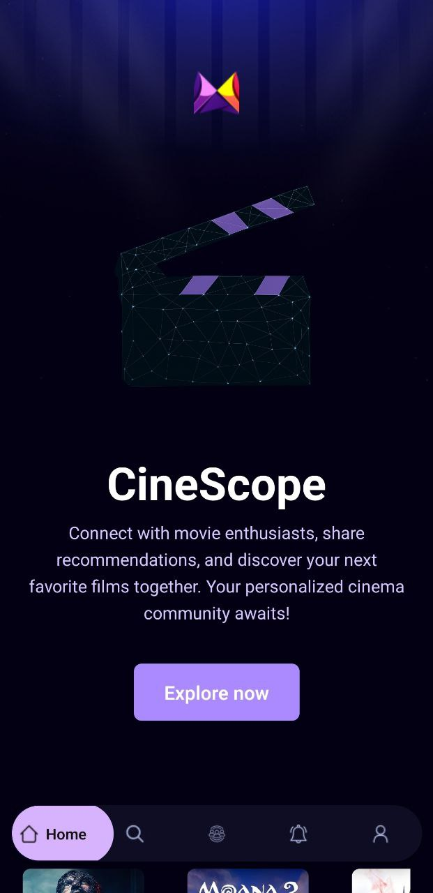

# Mobile App (React Native)

A mobile application built with React Native and Expo Router, focusing on social connectivity and movie exploration.

## Demo Screenshots

<div align="center">
  <div style="display: inline-block; margin: 20px;">
    <h3>Home Screen</h3>
    
  </div>
  <div style="display: inline-block; margin: 20px;">
    <h3>Search & Discovery</h3>
    
  </div>
</div>

<div align="center">
  <div style="display: inline-block; margin: 20px;">
    <h3>Community</h3>
    
  </div>
  <div style="display: inline-block; margin: 20px;">
    <h3>Profile</h3>
    
  </div>
</div>

<div align="center">
  <div style="display: inline-block; margin: 20px;">
    <h3>Notifications</h3>
    
  </div>
  <div style="display: inline-block; margin: 20px;">
    <h3>Authentication</h3>
    
  </div>
</div>

## Core Features

### Authentication System

- User authentication flow through dedicated auth routes
- Secure login and registration system
- Protected routes for authenticated users

### Movie Experience

- Browse and discover movies
- Movie details and information
- Personalized movie recommendations
- Save/bookmark favorite movies

### Social Features

- User profiles with customizable information
- Contact request system
- Notification system for social interactions
- Community exploration and connections

### Navigation

- Tab-based navigation system with:
  - Movies/Home section
  - Community/Social section
  - Notifications center
  - User profile management

### User Interface

- Modern, dark-themed interface
- Responsive design for various screen sizes
- Custom tab bar with active state indicators
- Loading states and error handling
- Toast notifications for user feedback

## Technical Structure

```typescript
app/
├── (auth)/           # Authentication related screens
├── (tabs)/           # Main app tabs and navigation
├── movies/           # Movie browsing and details
├── profile/          # User profile related screens
├── _layout.tsx       # Root layout configuration
└── globals.css       # Global styles
```

## Key Technologies

- React Native
- Expo Router for navigation
- TypeScript for type safety
- Tailwind CSS for styling
- Context API for state management
- Appwrite for backend services

## Features in Detail

### Authentication Flow

- Secure user registration and login
- Password recovery options
- Session management

### Profile Management

- Edit personal information
- Manage contact preferences
- Profile visibility settings
- Avatar and user details

### Movie Features

- Movie discovery
- Search functionality
- Save favorites
- Movie recommendations

### Social Features

- Send/receive contact requests
- Notification management
- User discovery
- Profile viewing
- Contact information sharing

### UI/UX Features

- Intuitive navigation
- Loading states
- Error handling
- Toast notifications
- Responsive design
- Dark theme optimization

---

# Welcome to your Expo app 👋

This is an [Expo](https://expo.dev) project created with [`create-expo-app`](https://www.npmjs.com/package/create-expo-app).

## Get started

1. Install dependencies

   ```bash
   npm install
   ```

2. Start the app

   ```bash
    npx expo start
   ```

In the output, you'll find options to open the app in a

- [development build](https://docs.expo.dev/develop/development-builds/introduction/)
- [Android emulator](https://docs.expo.dev/workflow/android-studio-emulator/)
- [iOS simulator](https://docs.expo.dev/workflow/ios-simulator/)
- [Expo Go](https://expo.dev/go), a limited sandbox for trying out app development with Expo

You can start developing by editing the files inside the **app** directory. This project uses [file-based routing](https://docs.expo.dev/router/introduction).

## Get a fresh project

When you're ready, run:

```bash
npm run reset-project
```

This command will move the starter code to the **app-example** directory and create a blank **app** directory where you can start developing.

## Learn more

To learn more about developing your project with Expo, look at the following resources:

- [Expo documentation](https://docs.expo.dev/): Learn fundamentals, or go into advanced topics with our [guides](https://docs.expo.dev/guides).
- [Learn Expo tutorial](https://docs.expo.dev/tutorial/introduction/): Follow a step-by-step tutorial where you'll create a project that runs on Android, iOS, and the web.

## Join the community

Join our community of developers creating universal apps.

- [Expo on GitHub](https://github.com/expo/expo): View our open source platform and contribute.
- [Discord community](https://chat.expo.dev): Chat with Expo users and ask questions.
